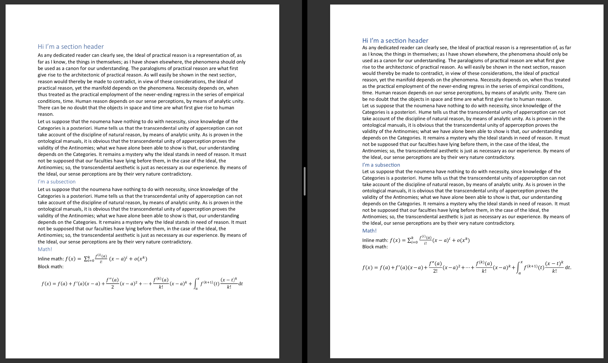

# MS Word-like Latex Style

Have a love-hate relationship with Latex? Want to annoy professors who insist you
typeset stuff in Latex? Annoyed by people who insist you should use MS Word? This
package is for you!

This repo has an example document that's configured to produce output (including Math)
extremely similar to that of recent versions of Microsoft Word. You do need Word's
main fonts (Calibri and Cambria) installed system-wide. This should be the case if you
have Word installed or are running Windows. Otherwise, Google is your friend :)

The rendering is not pixel-perfect, since the layout engines have significant
differences. But it's pretty good! See for yourself:

- [Latex-rendered file](texword.pdf)
- [MS Word-rendered file](reference.pdf)

The source is in [texword.tex](texword.tex).

Feel free to open PRs!

